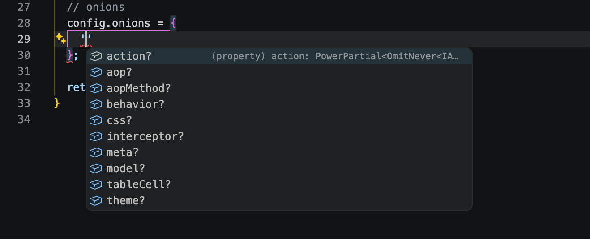
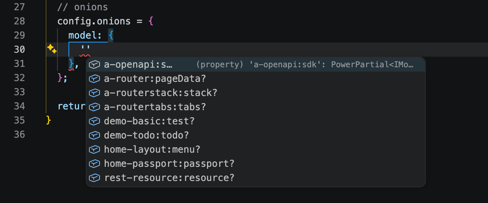
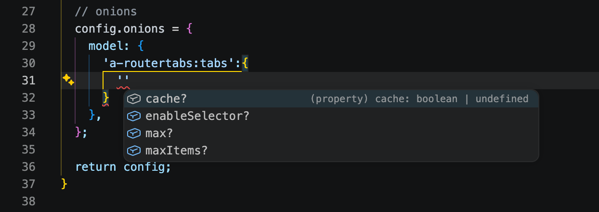

# Onion Name

The system will automatically assign an Onion name to each bean class as the following format:

```bash
{moduleName}:{beanName}
```

## For Example

- The module demo-student provides a component test which controller bean is `ControllerTest`

| Class Name     | Scene Name | Bean Identifier              | Onion Name        | Component Name |
| -------------- | ---------- | ---------------------------- | ----------------- | -------------- |
| ControllerTest | controller | demo-student.controller.test | demo-student:test | `= Onion Name` |

- The module a-routertabs provides a Model bean: ModelTabs

| Class Name | Scene Name | Bean Identifier         | Onion Name        | Model Name     |
| ---------- | ---------- | ----------------------- | ----------------- | -------------- |
| ModelTabs  | model      | a-routertabs.model.tabs | a-routertabs:tabs | `= Onion Name` |

## App Config

With a common Onion name, you can modify the parameters of all bean classes in App Config.

`src/front/config/config/config.ts`

```typescript
// onions
config.onions = {
  model: {
    'a-routertabs:tabs': {
      max: 10,
    },
  },
};
```

All configurations have type hints, as shown below:

- All Scene names type hints



- All Onion names type hints



- All parameters type hints


