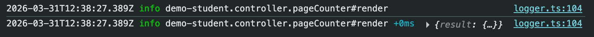
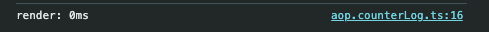

# How Intuitive, Elegant, and Powerful?🔥

Projects developed on Zova provide great capabilities while keeping the code intuitive and elegant at all times. Let's take a look at how to do it

## Intuitive: Reactive System

Zova still uses Vue3's intuitive reactive system, but defining reactive variables is like a native variable, without using `ref/reactive`, and naturally without `ref.value`

### Examples

```typescript
class ControllerPageCounter {
  count: number = 0;

  increment() {
    this.count++;
  }

  decrement() {
    this.count--;
  }

  protected render() {
    return (
      <div>
        <div>count: {this.count}</div>
        <button onClick={() => this.increment()}>Increment</button>
        <button onClick={() => this.decrement()}>Decrement</button>
      </div>
    );
  }
}
```

## Elegance: Global State Management: 4-in-1

In actual development, you will encounter four types of global state data: `asynchronous data (usually from the server)` and `synchronous data`, while `synchronous data` is divided into three types: `localstorage`, `cookie`, and `memory`. In the traditional Vue3, different mechanisms are used to handle these state data, while only a unified `Model` mechanism is needed in Zova

| Global State Data | Traditional Vue3     | Zova  |
| ----------------- | -------------------- | ----- |
| asynchronous data | Pinia                | Model |
| localstorage      | Pinia + Localstorage | Model |
| cookie            | Pinia + Cookie       | Model |
| memory            | Pinia                | Model |

The model mechanism can be used to manage these global state data in a unified manner, which can automatically support SSR, standardize data usage, simplify code structure, and improve code maintainability

### Example: How to define

```typescript
import { BeanModelBase } from 'zova-module-a-model';

class ModelData extends BeanModelBase {
  data1?: string;
  data2?: string;
  data3?: string;

  protected async __init__() {
    // sync data
    this.data1 = this.$useStateMem({ queryKey: ['data1'] });
    this.data2 = this.$useStateCookie({ queryKey: ['data2'] });
    this.data3 = this.$useStateLocal({ queryKey: ['data3'] });
  }

  // async data
  data4() {
    return this.$useStateData({
      queryKey: ['data4'],
      queryFn: async () => {
        return await getDataFromServer();
      },
    });
  }
}
```

> Some people may ask, why don't you just use `this.data1 = 'some value'` for memory state data？
>
> > Because in the SSR scenario, the memory state data defined on the server needs to be hydrated to the client, then `$useStateMem` needs to be used

### Example: How to use

```typescript
import { ModelData } from '../../model/data.js';

class ControllerPageTest {
  @Use()
  $$modelData: ModelData;

  // sync data
  handleSyncDataGet() {
    console.log(this.$$modelData.data1);
    console.log(this.$$modelData.data2);
    console.log(this.$$modelData.data3);
  }

  // sync data
  handleSyncDataSet() {
    this.$$modelData.data1 = 'new value';
    this.$$modelData.data2 = 'new value';
    this.$$modelData.data3 = 'new value';
  }

  // async data
  protected render() {
    const { data, error } = this.$$modelData.data4();
    if (error) {
      return <div>{error.message}</div>;
    }
    return <div>{data}</div>;
  }
}
```

## Elegance: State Sharing: 4-in-1

In actual development, there are four scopes of state sharing: `component internal`, `between components`, `global` and `system`. In the traditional Vue3, different mechanisms are used to achieve these state sharing scopes, while only a unified IOC container mechanism is needed in Zova

| Scope of state sharing | Traditional Vue3 | Zova |
| ---------------------- | ---------------- | ---- |
| Component internal     | Composable       | IOC  |
| Between components     | Provide/Inject   | IOC  |
| Global                 | Pinia            | IOC  |
| System                 | ES Module        | IOC  |

> Some people may ask, what is the difference between `global state sharing` and `system state sharing`?
>
> > Because in SSR scenarios, `global state sharing` is for each request, and `system state sharing` can cross requests

### Example: Create a service

```typescript
class ServiceData {
  count: number = 0;

  increment() {
    this.count++;
  }

  decrement() {
    this.count--;
  }
}
```

### Example: Dependency injection

```typescript
import { ServiceData } from '../../service/data.js';

class ControllerPageTest {
  // Component internal
  @Use()
  $$serviceData: ServiceData;

  // Between components
  @Use({ injectionScope: 'host' })
  $$serviceData2: ServiceData;

  // Global
  @Use({ injectionScope: 'app' })
  $$serviceData3: ServiceData;

  // System
  @Use({ injectionScope: 'sys' })
  $$serviceData4: ServiceData;
}
```

## Powerful: IOC + AOP

We know that IOC is an effective architectural design for system decoupling, and is also a supporting tool for the development of large-scale business systems. Zova provides powerful AOP programming capabilities on top of IOC, making the system more extensible and maintainable

AOP programming in Zova includes: `Internal Aspect`, `External Aspect`, `Behavior`, `Interceptor`. Here are just two examples:

### Example: Internal Aspect

Taking the previous class `ControllerPageCounter` as an example, to output the execution time of the render method in the console, the code is as follows:

```diff
import { Log } from 'zova-module-a-logger';

class ControllerPageCounter {
+ @Log()
  protected render() {
    ...
  }
}
```

The console output is as follows:



### Example: External Aspect

It is also possible to cut into the Log logic from the external without changing the source code of the Class `ControllerPageCounter`

```typescript
@Aop({ match: 'demo-student.controller.pageCounter' })
class AopCounterLog {
  render = (_args, next, _receiver) => {
    const timeBegin = Date.now();
    const res = next();
    const timeEnd = Date.now();
    console.log(`render: ${timeEnd - timeBegin}ms`);
    return res;
  };
}
```

The console output is as follows:


