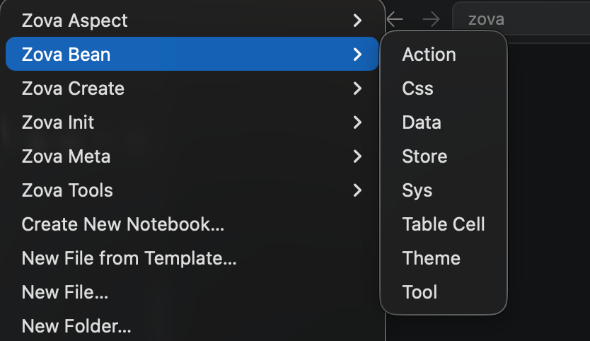
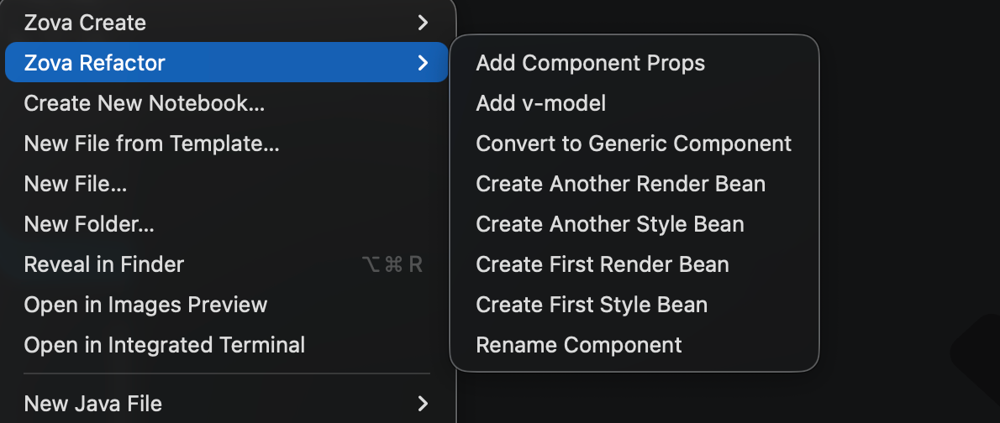
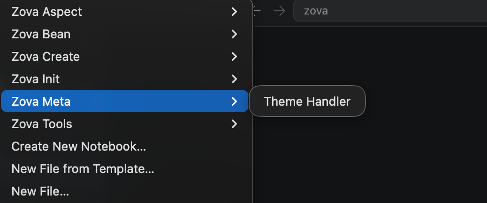

# Menu Commands

Zova provides a large number of menu commands based on Cli commands. Cli commands can be executed through menus, which significantly reduces the mental burden and improves the development experience

## VS Code Extension: [Zova - Official](https://marketplace.visualstudio.com/items?itemName=cabloy.zova-vscode)

In order to use menu commands, you need to install this extension

## Menus

### Zova Aspect

### Zova Bean

### Zova Create

### Zova Refactor(Page)

### Zova Refactor(Component)

### Zova Init

### Zova Meta

### Zova Tools

**Enjoy!**
