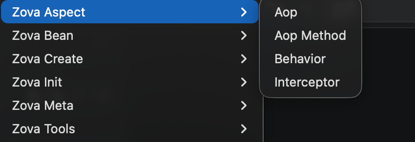
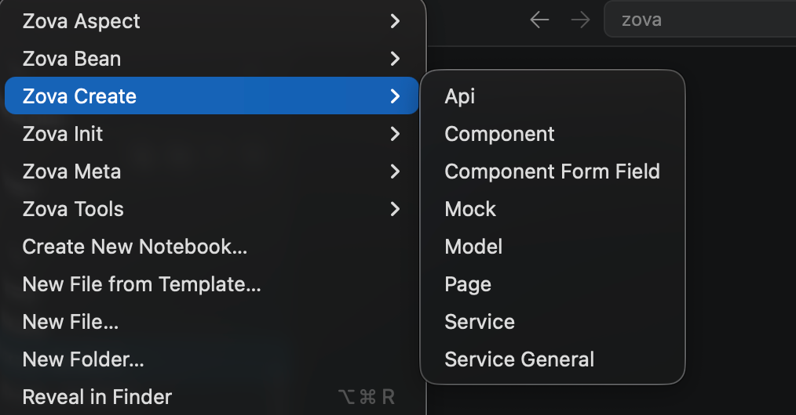
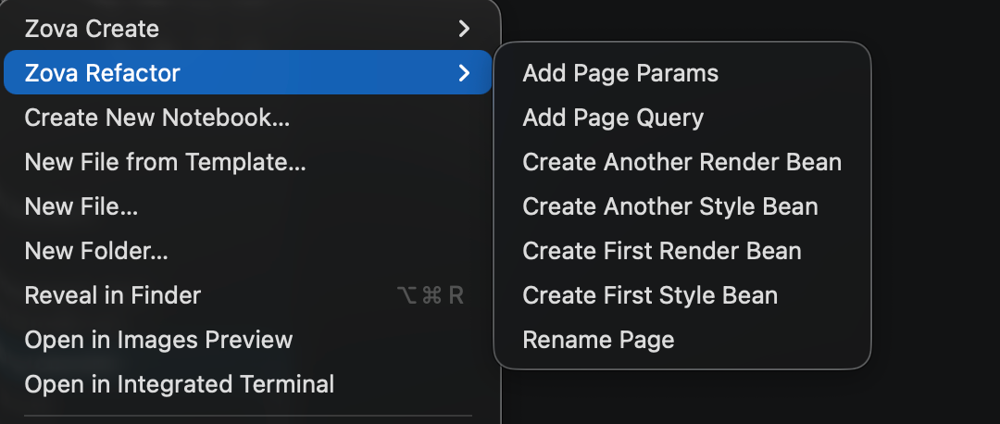
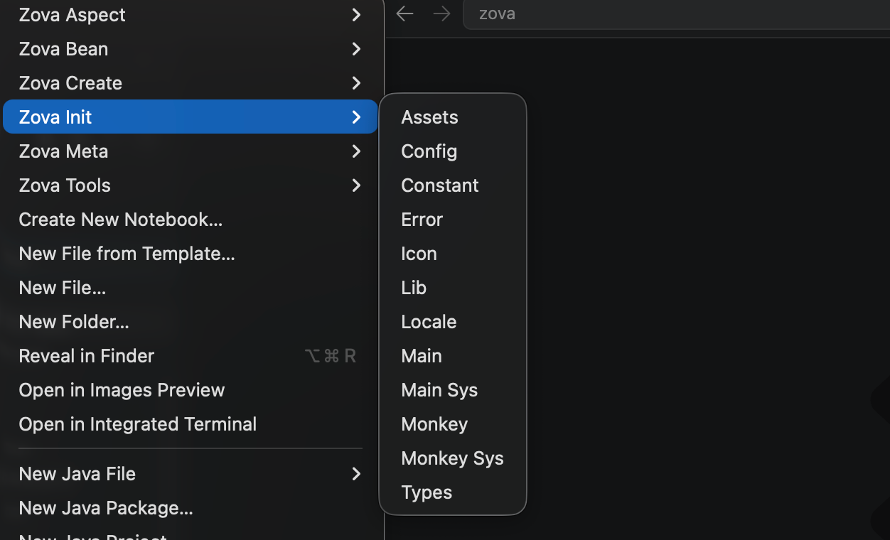
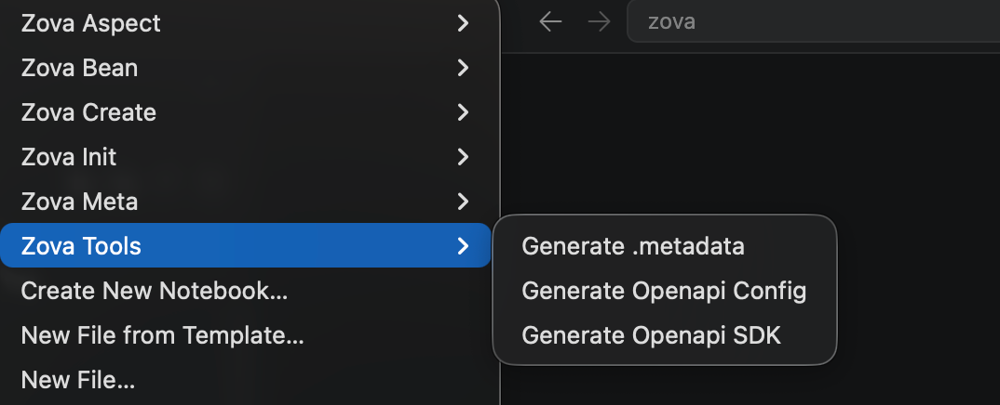

# 菜单命令

Zova 在 Cli 命令的基础上提供了大量菜单命令，通过菜单来执行 Cli 命令，从而显著降低心智负担，提升开发体验

## VS Code 插件: [Zova - Official](https://marketplace.visualstudio.com/items?itemName=cabloy.zova-vscode)

为了使用菜单命令，需要安装该插件

## 菜单清单

### Zova Aspect

### Zova Bean

### Zova Create

### Zova Refactor(Page)

### Zova Refactor(Component)

### Zova Init

### Zova Meta

### Zova Tools

**Enjoy!**
